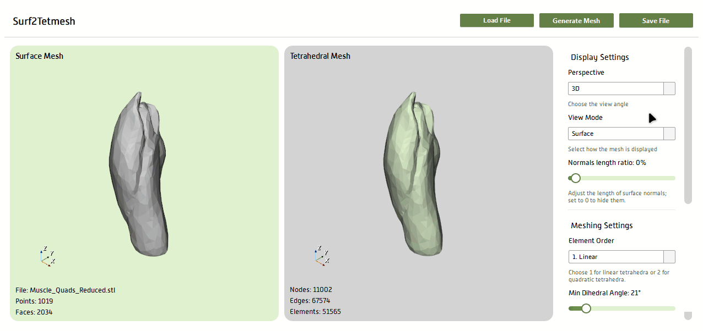

# 🌊 Surf2TetMesh


> **Surf2TetMesh** is a modern desktop application for converting **surface meshes (STL)** into **volumetric tetrahedral meshes** ready for **Finite Element Method (FEM)** simulation.  
> Built with Python, PySide6, Qt Designer, and VTK — it combines interactive visualization with robust mesh generation powered by **TetGen**.

  

---

## 🧭 Overview

Surf2TetMesh bridges the gap between 3D modeling and simulation by letting users:
- Load any `.stl` surface mesh
- Visualize it interactively in a real-time 3D viewer
- Adjust **TetGen** parameters for tetrahedralization
- Preview and toggle between **surface**, **wireframe**, or **volume** views
- Export the resulting FEM-ready volumetric mesh to disk (recommended format: **`.vtk`** or **`.msh`**)

---

## 🎥 Demos

### 1️⃣ Load an STL Surface Mesh
> The app supports drag-and-drop or file selection from your desktop.

  
*Loading and visualizing an STL surface mesh.*

---

### 2️⃣ Generate Tetrahedral Mesh
> Adjust TetGen parameters and create a volumetric mesh with one click.

  
*Fine-tuning TetGen parameters and generating a tetrahedral mesh.*

---

### 3️⃣ Explore Mesh Visualization
> Switch between display modes and interact with the 3D scene.

  
*Toggling between surface, wireframe, and volume renderings.*

---

## 🖥️ Features at a Glance

- 🧩 **Dual Viewer Layout:** Side-by-side 3D viewers for comparing surface and volumetric meshes  
- ⚙️ **TetGen Integration:** Fine-grained control over meshing parameters  
- 💾 **Export Options:** Save volumetric mesh in **`.vtk`** (VTK legacy) or **`.msh`** (Gmsh) formats  
- 🖱️ **Interactive Visualization:** Rotate, zoom, and inspect meshes in real time  
- 🎨 **Modern Adaptive UI:** Responsive layout with scrollable panels  
- 🧠 **Built for Simulation:** Ideal for pre-processing before FEM or CFD workflows  

---

## 🚀 Getting Started

### 🧰 Prerequisites
Make sure you have Python 3.10+ installed.

### 📦 Installation
Clone the repository and install dependencies:

```bash
git clone https://github.com/yourusername/surf2tetmesh.git
cd surf2tetmesh
pip install -r requirements.txt
